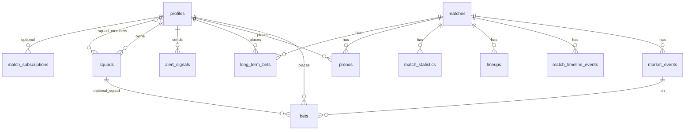

# PROJECT_STATE — VAR Time

> Documentation vivante. Ne documente que le **code et le schéma présents** dans ce dépôt (pas la roadmap produit seule).
>
> **Dernière mise à jour : squads persistantes (0041) + UI « Mes ligues » / braquage.**

---

## 🎯 Vision du MVP (rappel)

**VAR Time** — PWA mobile-first « second écran » foot : signaux communautaires (mécanique type Waze), paris instantanés sur le verdict, pronostics avant match, ligue privée par match. Ton tutoiement / MPG. Monnaie virtuelle « Pts » (`sifflets_balance`), pas d’argent réel.

---

## 🏗️ Architecture technique

| Couche | Choix | Détails |
|--------|--------|---------|
| Front | **Next.js 16** (App Router) | Server Components par défaut, `"use client"` ciblé. |
| UI | **React 19** + **Tailwind v4** + `lucide-react` | Tokens : `pitch-*`, `chalk`, `whistle`. |
| Toasts | `sonner` | Monté dans le layout racine. |
| Auth & DB | **Supabase** (`@supabase/ssr`) | Google OAuth PKCE ; middleware refresh JWT. |
| Realtime | Supabase | Tables publiées avec **`REPLICA IDENTITY FULL`** là où nécessaire : `matches`, `market_events`, `bets`, `match_timeline_events`, `profiles`, `match_statistics`, `user_badges` (voir migrations `0004`–`0006`, `0012`–`0013`, `0035`, `0022`). `alert_signals` en publication sans garantie FULL dans ce repo — à valider en prod. |
| Données live | **API-Football** (v3 api-sports.io) | Client [`src/lib/api-football-client.ts`](src/lib/api-football-client.ts), sync [`src/services/api-football-sync.ts`](src/services/api-football-sync.ts), import calendrier [`src/services/api-football-fixtures-import.ts`](src/services/api-football-fixtures-import.ts). |
| Données cosmétique | **TheSportsDB** | Calendrier / assets ; ne doit pas écraser le nom compétition si `api_football_league_id` est posé ([`src/services/sportsdb-sync.ts`](src/services/sportsdb-sync.ts)). |
| Admin | `service_role` | [`src/lib/supabase/admin.ts`](src/lib/supabase/admin.ts). |
| API shape | `{ ok, data \| error }` | [`src/lib/api-response.ts`](src/lib/api-response.ts). |

**Clients Supabase typés** : `server.ts`, `client.ts`, `admin.ts` — générique `Database` depuis [`src/types/database.ts`](src/types/database.ts).

---

## 🗄️ Schéma de données (état des migrations)

**Fichiers SQL** : `supabase/migrations/0001_init.sql` → **`0044_squad_by_invite_code_rpc.sql`** (44 migrations versionnées).

### Tables & objets notables (post-0033)

| Migration | Contenu |
|-----------|---------|
| **0032** | `competitions.api_football_league_id` (UNIQUE partiel). |
| **0033** | `matches.round_short`, `matches.has_lineups`. |
| **0034** | `matches.last_events_sync_at` (horodatage sync événements — mis à jour côté sync, voir `api-football-sync.ts`). |
| **0035** | `match_statistics` + index + Realtime `REPLICA IDENTITY FULL`. |
| **0036** | `profiles` : `xp`, `avatar_url`, `rank`, `updated_at` (affichage `rank` dans [`TopBar`](src/components/layout/TopBar.tsx) / layout app). |
| **0037** | `pronos` + RLS + RPC **`place_prono`** (insert gratuit, pas de débit solde). |
| **0038** | Parimutuel global + premier modèle braquage (`bets.room_id` → `rooms` par match). |
| **0039** | Types `market_events` / `alert_signals` : ajout `free_kick`, `corner` (noms alignés `penalty_check`, `var_goal`, …). |
| **0040** | `match_subscriptions` (PK `user_id`, `match_id`, `smart_mute`) — **aucune référence dans `src/` au moment de l’audit** (table prête, pas d’UI ni de cron push). |
| **0041** | **Squads persistantes** : tables `squads` (`owner_id`, pas de `match_id`) + `squad_members` ; migration données `rooms` → `squads` ; `bets.room_id` → **`bets.squad_id`** ; **`place_bet(..., p_squad_id)`** (vérif membre) ; **`resolve_event_parimutuel`** : braquage par **`squad_id`** sur l’événement (pot perdants de la squad → gagnants de la même squad sur le même `event_id`). RLS `squad_members` SELECT = **ligne du user uniquement** + RPC **`squad_members_for_my_squads`** + **`squad_by_invite_code`** (rejoindre par code). **Idempotente** (rejouable : `CREATE IF NOT EXISTS`, copie `rooms` / colonne `room_id` seulement si présentes). |
| **0042** | `lineups.shirt_number` (texte, API-Football `player.number`) ; rempli par **`syncMatchLineups`** ; terrain [`MatchLineupsPitch`](src/components/match/MatchLineupsPitch.tsx) affiche le numéro dans la pastille (fallback initiales). |
| **0043** | **Correctif RLS** : recréation de `squad_members_select_visible` (sans lecture de `squads`) + **`squad_members_for_my_squads()`** si la base a été migrée avec l’ancienne 0041 (récursion infinie). |
| **0044** | RPC **`squad_by_invite_code(p_invite)`** — résout une ligue privée par code d’invitation (SECURITY DEFINER) : le SELECT direct sur `squads` est masqué par RLS pour un non-membre ; [`POST /api/squads/join`](src/app/api/squads/join/route.ts) utilise cette RPC. *(Également ajoutée en fin de bloc squads dans la 0041 pour les installs complètes.)* |

### RPC métier (SECURITY DEFINER) — présents dans `database.ts`

- `place_bet(p_event_id, p_chosen_option, p_amount_staked, p_multiplier, p_squad_id)` — débit + insert ; `squad_id` optionnel (oblige à être membre de la squad si renseigné).
- **`squad_members_for_my_squads()`** — liste `squad_id` / `user_id` des membres des squads dont l’utilisateur est membre ou propriétaire (appelée par [`GET /api/squads`](src/app/api/squads/route.ts), contourne la RLS restrictive sur `squad_members`).
- **`squad_by_invite_code(p_invite)`** — retourne la ligne `squads` pour un code valide (rejoindre une ligue privée).
- `get_event_odds(p_event_id)` — lecture parimutuel (exposé au client typé ; usage UI à consolider).
- `place_prono(...)` — pronos gratuits.
- `place_long_term_bet` / `resolve_long_term_bets` — **schéma + routes API** [`long-term-bet`](src/app/api/long-term-bet/route.ts), [`finish-match`](src/app/api/admin/finish-match/route.ts) ; **l’onglet match n’appelle plus ces routes** — l’UI avant match utilise **`pronos`** via `PolymarketTab`.
- **`resolve_event_parimutuel`** — appelé depuis [`resolve-event.ts`](src/lib/resolve-event.ts) (admin) : parimutuel global + **braquage par squad** sur l’événement (0041). L’ancienne RPC `resolve_event` peut subsister en base pour compat ; le flux produit utilise le parimutuel.
- Trigger auth → `profiles` + solde initial (cf. migrations init / extras).

### Diagramme relationnel (simplifié)



---

## 🔄 Synchronisation API-Football & cron **match-monitor**

### Fonctions serveur ([`api-football-sync.ts`](src/services/api-football-sync.ts))

- **`syncMatchEvents(matchId)`** — `GET /fixtures/events` → upsert `match_timeline_events` ; met à jour **`last_events_sync_at`** sur `matches` en succès.
- **`syncMatchStatistics(matchId)`** — `GET /fixtures/statistics` → upsert `match_statistics` ; met **`last_stats_sync_at`** sur `matches`.
- **`syncMatchLineups(matchId)`** — `GET /fixtures/lineups` → `lineups` (dont **`shirt_number`** depuis `player.number`) + **`has_lineups`** / données équipe sur `matches`.
- **`syncApiFootballMatch(matchId)`** — orchestrateur fin de match : fixture + lineups + events + stats en chaîne (délais internes) ; utilisé aussi par admin / `syncLiveMatches` (plafonné).

Helpers : `patchMatchFromFixtureRow`, `mapApiFootballFixtureStatusShort`, mapping statuts API → `MatchStatus`, etc.

### [`GET /api/cron/match-monitor`](src/app/api/cron/match-monitor/route.ts)

**Auth** : `Authorization: Bearer <CRON_SECRET>`.

**Sélection** : matchs `upcoming` avec `start_time` dans une fenêtre (bientôt + léger rétro) **ou** matchs `first_half` / `half_time` / `second_half` / `paused`, tous avec `api_football_id` non null.

**À chaque exécution (~1 min)** :

1. **Batch fixtures** (`/fixtures?ids=…`, paquets de 20) → mise à jour score, minute, statut interne via `patchMatchFromFixtureRow`.
2. **Events** : pour chaque match dont le statut API court est dans `LIVE_STATUS_SHORT` (`1H`, `2H`, `HT`, …), appel **`syncMatchEvents`** ; délai inter-match configurable `MATCH_MONITOR_EVENTS_DELAY_MS` (défaut 200 ms).
3. **Stats** : sur les mêmes matchs live, si **`last_stats_sync_at`** absent ou &gt; **5 minutes** → **`syncMatchStatistics`**.
4. **Lineups backfill** : si **`has_lineups`** faux et (coup d’envoi dans **45 min** ou match déjà en jeu) → **`syncMatchLineups`**.
5. **Fin** : si statut API ∈ `FT`, `AET`, `PEN`, … → **`syncApiFootballMatch`** (sync complète une fois).

**Réponse JSON** : compteurs `fixtureApiCalls`, `matchesPatchedFromFixture`, `eventsSyncCount`, `statsSyncCount`, `lineupBackfillCount`, `fullSyncOnEndCount`, `errors[]`.

> **Précision** : il n’existe **pas** dans ce fichier de branche « score changé → `syncApiFootballMatch` immédiat » ; le rafraîchissement timeline/stats repose sur les **étapes 2–3** en boucle cron + `syncMatchEvents` / heartbeat stats.

### Autres entrées sync

- [`GET /api/admin/sync-apifootball-fixtures`](src/app/api/admin/sync-apifootball-fixtures/route.ts) — par date (ligues suivies lobby).
- [`GET /api/admin/sync-apifootball-round`](src/app/api/admin/sync-apifootball-round/route.ts) — `leagueId` + `roundName` (libellé API).
- [`GET /api/admin/sync-live`](src/app/api/admin/sync-live/route.ts) — `syncLiveMatches` (quota, throttle).

---

## 🖥️ Composants & routes UI actifs

### Lobby

- [`src/app/(app)/lobby/page.tsx`](src/app/(app)/lobby/page.tsx) — `searchParams` `league` + `round` → `fetchLobbyMatchesByRound` ; sinon **`fetchLobbyMatchesForParisDayWithFallback`** : **football day** (date Paris de `now − 4h`, voir [`paris-day.ts`](src/lib/paris-day.ts)) puis requête légère + jour civil Paris du prochain coup d’envoi si 0 match ; bandeau **« Aujourd’hui : repos »** dans [`MatchLobby`](src/components/lobby/MatchLobby.tsx).
- [`src/components/lobby/MatchLobby.tsx`](src/components/lobby/MatchLobby.tsx) — onglets **Direct** (live ou upcoming avec compos), **Top 5**, **Europe** ; groupes par ligue ; lien « Toute la {round_short} → ».
- [`src/components/lobby/MatchCard.tsx`](src/components/lobby/MatchCard.tsx) — layout MPG optionnel ; noms `line-clamp-2` ; minute live en badge rouge imposant ; ligne buteurs en scroll horizontal masqué.
- Constantes ligues : [`src/lib/constants/top-leagues.ts`](src/lib/constants/top-leagues.ts) — **5 championnats + 3 coupes UEFA** (8 compétitions suivies au sens « IDs » ; onglet Europe = agrégé).

### Page match

- [`src/app/(app)/match/[id]/page.tsx`](src/app/(app)/match/[id]/page.tsx) — `LiveRoom` + solde + modérateur.
- [`src/components/match/LiveRoom.tsx`](src/components/match/LiveRoom.tsx) — onglets **Kop** / **Compo** / **Pronos** (si `upcoming`) ou **Stats** (sinon) ; Realtime `matches`, `market_events`, `bets` ; `VotingModal` si event ouvert ; **squad active** via [`useActiveSquad`](src/hooks/useActiveSquad.ts) (localStorage) → `squad_id` envoyé à [`/api/bet`](src/app/api/bet/route.ts).
- [`MatchTimeline.tsx`](src/components/match/MatchTimeline.tsx) — remplacements : entrant / sortant (`details` JSON `assist` + `player_name`) avec flèches **ArrowUpRight** / **ArrowDownRight**. [`MatchLineups.tsx`](src/components/match/MatchLineups.tsx) + [`MatchLineupsPitch.tsx`](src/components/match/MatchLineupsPitch.tsx) — pastilles terrain = **`shirt_number`** si présent (0042). [`MatchStats.tsx`](src/components/match/MatchStats.tsx) — stats Realtime ; couleurs club.
- [`PolymarketTab.tsx`](src/components/match/PolymarketTab.tsx) — pronos gratuits RPC `place_prono` ; **Bunker 0-0** : bloc plein écran « drama » (masque la grille buteurs), récompense dédiée.
- Alignement vertical des contenus d’onglets **`mt-6`** ; shell **`bg-zinc-950`** (body + pages lobby / match).
- [`VotingModal.tsx`](src/components/match/VotingModal.tsx) — timer 90 s, cotes dégressives, **slider + presets MIN/MOITIÉ/ALL IN**, **deux gros boutons** OUI/NON ; mention **« Braquage actif avec [nom] »** si squad sélectionnée.
- [`ActionDrawer.tsx`](src/components/match/ActionDrawer.tsx) — alertes (types 0039), modération timeline, états match, sync TSDB.
- **Squads** : page [`/(app)/squads`](src/app/(app)/squads/page.tsx) + [`SquadsPageClient`](src/components/squads/SquadsPageClient.tsx) ; API [`/api/squads`](src/app/api/squads/route.ts), [`join`](src/app/api/squads/join/route.ts), [`leave`](src/app/api/squads/leave/route.ts) — en cas d’échec Supabase ou d’exception, les handlers loggent `console.error("Supabase Error:", …)` côté serveur pour diagnostic terminal ; onglet **Ligues** dans [`BottomNav`](src/components/layout/BottomNav.tsx) (remplacé par le Super-Bouton uniquement sur une page match en direct).

### Autres pages app notables

- Profil, leaderboard, règles, admin resolve, login, landing `/` ([`src/app/page.tsx`](src/app/page.tsx)) — VAR Time, tutoiement, hero + 4 blocs gameplay + 3 étapes vestiaire / Sifflets / braquage, grades kop conservés.

---

## ✅ Ce qui est implémenté et branché (résumé « prod code »)

- Auth Google + garde middleware `/lobby`, `/match/*`, `/squads`, `/profile`, `/leaderboard`.
- Lobby **8 ligues** (IDs Top 5 + UEFA), jour Paris, vue **`?league=&round=`** + `round_short` / `has_lineups`.
- Cron **`match-monitor`** : fixtures batch + events live + heartbeat stats 5 min + backfill lineups + sync full FT.
- **Stats match** en direct : table + UI + Realtime après sync.
- **Timeline** + lineups API-Football ; terrain **`MatchLineupsPitch`**.
- **Paris court terme** `place_bet` avec **`squad_id`** optionnel (membre vérifié en RPC) ; **`VotingModal`** (slider + one-tap) ; résolution + **braquage par squad** via **`resolve_event_parimutuel`** (0041).
- **Pronos** avant match (`pronos` + `place_prono`) dans **`PolymarketTab`** (score exact + buteur, variante Bunker 0-0).
- **Squads persistantes** : création / rejoindre / quitter sur **`/squads`** ; squad active en local → paris match avec braquage intra-squad sur l’événement.
- **Profil** : solde **`sifflets_balance`**, historique **Paris court + long terme**, refill, badges, `rank` DB dans la topbar.
- **Types d’alertes** étendus (`free_kick`, `corner`) alignés `market_events` / `alert_signals` (0039) — **à vérifier** cohérence avec libellés UI du drawer vs contraintes SQL historiques si anciennes données.

---

## 🚧 Écarts, incomplets ou sans câblage UI

| Sujet | État réel |
|--------|-----------|
| **`match_subscriptions`** (0040) | Table + RLS ; **aucun** code app / cron notifications. |
| **`get_event_odds`** | Exposé en types ; **pas** de consommation visible dans les composants de cote affichée parimutuel temps réel. |
| **Résolution automatique des `pronos`** | Insert + `status`/`reward` : **pas** de job / RPC de résolution trouvé dans le repo pour passer `won`/`lost` et créditer les Pts. |
| **`long_term_bets` payants** | Migrations + API + profil ; **plus** de flux création depuis `PolymarketTab` (remplacé par `pronos`). |
| **Vérification auto résolution event** | [`sportsProvider.ts`](src/lib/sports/sportsProvider.ts) reste un **mock** probabiliste. |
| **Déclencheur VAR 100 % auto** | Seuil communautaire sur **`/api/alert`** (signaux utilisateurs) — pas d’auto-déclencheur sans signal. |
| **Tests E2E** | [`tests/e2e/user-journey.spec.ts`](tests/e2e/user-journey.spec.ts) aligné sur **Kop / Compo / Pronos \| Stats / Ligue** + parcours **Pronos** (score exact, bunker 0-0). |
| **`match_minute`** | Alimentée via sync API-Football sur `matches` ; pas de « chronomètre » autonome côté app hors données fournisseur. |

---

## 🧪 Tests & commandes

```bash
npm run dev
npm run build
npm run lint && npm run typecheck
npm run test:backend   # scripts/simulate-match-scenario.ts
npm run test:e2e       # Playwright — voir décalage libellés onglets ci-dessus
```

Script SQL utilitaire : `supabase/audit_pending_bets.sql`.

---

## 📌 Next Steps (priorité produit / tech — **VAR TIME economy**)

Implémentation explicite demandée pour la suite :

1. **Économie Pts cohérente** — Finaliser le cycle **`pronos`** : RPC ou job post-match qui résout `pronos` (score final + timeline buteurs), met à jour `status`, crédite **`profiles.sifflets_balance`** selon `reward_amount`, idempotence par match.
2. **Profils** — Exposer progressivement **`xp`**, **`avatar_url`**, progression liée aux paris / pronos résolus ; aligner le **grade affiché** (`getRank` local vs `profiles.rank` DB) si une seule source de vérité est requise.
3. **Modale One-Tap (paris live)** — Déjà présente (`VotingModal` : slider + gros boutons) : **QA mobile**, accessibilité (focus trap, `aria-*`), et **affichage des cotes parimutuel** via `get_event_odds` si le produit veut remplacer / compléter les cotes dégressives fixes.
4. **Nettoyage / dette** — Retirer ou réactiver **`long_term_bets`** côté UI ; brancher **`match_subscriptions`** (création à la première interaction match + préférences mute) ; corriger les **E2E** sur les libellés d’onglets.

---

*Fin du document — audit codebase au 2026-05-03 22:31 CEST.*
