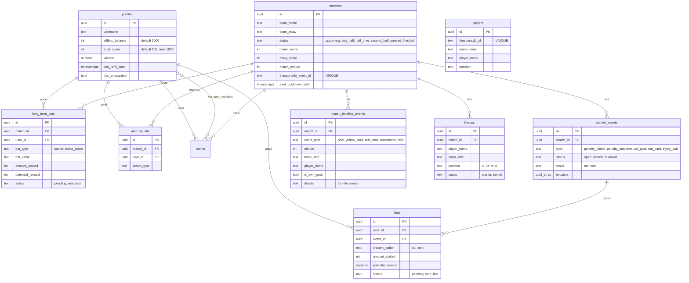

# PROJECT_STATE — Le Sifflet

> Documentation vivante de l'application. À mettre à jour à chaque évolution majeure (feature, schéma, bug critique).
> Dernière mise à jour : 2026-04-30 — tests automatisés (simulation backend + Playwright E2E).

---

## 🎯 Vision du MVP

**Le Sifflet** est une PWA mobile-first « second écran » pour fans de foot, pensée pour la Coupe du Monde 2026. Le joueur incarne un arbitre virtuel : il signale les actions litigieuses en direct (mécanique Waze), mise des « Sifflets » sur le verdict et grimpe au classement.
Le ton est tongue-in-cheek (tutoiement, références MPG), 100 % gratuit, aucune monnaie réelle.

---

## 🏗️ Architecture technique

| Couche | Choix | Détails |
|---|---|---|
| Front | **Next.js 16** (App Router) | Server Components par défaut, `"use client"` ciblé. |
| UI | **React 19** + **Tailwind v4** + `lucide-react` | Tokens custom : `pitch-800/900`, `chalk`, `whistle`. |
| Toasts | `sonner` | Provider monté dans `src/app/layout.tsx`. |
| Auth & DB | **Supabase** (`@supabase/ssr` 0.10) | OAuth Google PKCE, JWT rafraîchi par middleware. |
| Realtime | Supabase Realtime | 6 tables en `REPLICA IDENTITY FULL` : `matches`, `market_events`, `bets`, `alert_signals`, `profiles`, `match_timeline_events`. |
| Données externes | TheSportsDB API | `src/lib/services/thesportsdb.ts` — Ligue 1 (4334) + Champions League (4480). |
| Sécurité serveur | `service_role` admin client | `src/lib/supabase/admin.ts` — bypass RLS pour les opérations sensibles. |
| Réponses API | Helpers `successResponse` / `errorResponse` | `src/lib/api-response.ts` — shape `{ ok, data | error }`. |
| Middleware | `src/middleware.ts` | Refresh JWT + protection `/lobby` et `/match/*`. |

**Trois clients Supabase typés `<Database>`** :
- `src/lib/supabase/server.ts` → Server Components, Route Handlers, Server Actions.
- `src/lib/supabase/client.ts` → Client Components.
- `src/lib/supabase/admin.ts` → service_role uniquement (jamais exposé client-side).

**RPC métier (SECURITY DEFINER)** :
- `place_bet(p_event_id, p_chosen_option, p_amount_staked, p_multiplier)` — débit atomique + insert pari court terme.
- `place_long_term_bet(p_match_id, p_bet_type, p_bet_value, p_amount_staked, p_potential_reward)` — débit atomique + insert pari long terme.
- `resolve_event(p_event_id, p_result)` — paye gagnants + ajuste karma initiateurs (service_role only).
- `handle_new_user()` — trigger Supabase qui crée le profil + 1000 Sifflets à l'inscription.

---

## 🗄️ Schéma de données



**Contraintes structurantes** :
- `bets (user_id, event_id)` UNIQUE → un seul pari court terme par event.
- `long_term_bets (match_id, user_id, bet_type, bet_value)` UNIQUE → un seul pari par option.
- `profiles.sifflets_balance >= 0` CHECK + UPDATE limité à `username` côté client.
- `auth.users` → trigger `on_auth_user_created` → INSERT auto dans `profiles`.

**Migrations appliquées** : `0001` à `0020` — schéma + alert signals + RPCs + Realtime fixes + nouveaux types d'alertes + karma + refill + livescore + place_bet v2 + timeline + Realtime profiles + couleurs équipes + match states granulaires + own_goal + long term bets + RLS lineups + table players + info events.

---

## ✅ Features terminées (de bout en bout)

| Domaine | Détail | Fichiers clés |
|---|---|---|
| **Auth** | Google OAuth PKCE → callback → cookies sécurisés. | `src/app/auth/callback/route.ts`, `src/app/login/page.tsx`, `src/middleware.ts` |
| **Onboarding** | Modal 3 étapes au premier login, flag `has_onboarded`. | `src/components/onboarding/Onboarding.tsx`, `src/app/actions/onboarding.ts` |
| **Lobby** | Tri En Direct → À venir → Terminés, `MatchCard` aérée. | `src/app/(app)/lobby/page.tsx`, `src/components/lobby/MatchCard.tsx`, `src/lib/matches.ts` |
| **Live Room** | 4 abonnements Realtime (matches, market_events INSERT/UPDATE, bets UPDATE filtré user). | `src/components/match/LiveRoom.tsx` |
| **Mécanique Waze** | Seuil 2 users distincts en 30 s → `market_event` OPEN + cooldown 3 min. | `src/app/api/alert/route.ts` |
| **VotingModal** | Cotes dégressives (peak par type, decay 2.5 %/s après 10 s, floor 1.01). | `src/components/match/VotingModal.tsx`, `src/lib/constants/odds.ts` |
| **Paris court terme** | RPC atomique `place_bet` v2 (vérif multiplier serveur, FOR UPDATE, UNIQUE). | `src/app/api/bet/route.ts`, migration `0011_place_bet_v2.sql` |
| **Résolution events court terme** | Auto via API mock (≥ 3 min) + admin manuel. Payout + karma initiateurs (+10 / -20). | `src/app/api/verify-event/route.ts`, `src/app/api/admin/resolve-event/route.ts`, `src/lib/resolve-event.ts`, migration `0008_karma_waze.sql` |
| **Notifications** | Toast Sonner sur win/loss + flash animé du solde TopBar. | `src/components/match/LiveRoom.tsx`, `src/components/layout/TopBar.tsx` |
| **Profil** | Hero, solde, grade trust score, refill quotidien, stats (réussite, gagné, paris), historique paris court terme. | `src/app/(app)/profile/page.tsx`, `src/components/profile/RefillButton.tsx` |
| **Refill quotidien** | +500 Sifflets si solde < 500 et cooldown 24 h respecté. | `src/app/api/refill/route.ts`, migration `0009_profile_extras.sql` |
| **Leaderboard** | Top 50 + podium + ligne « moi » sticky + badge 🛡️ pour `trust_score >= MODERATOR_THRESHOLD`. | `src/app/(app)/leaderboard/page.tsx` |
| **Sécurité admin** | `MODERATOR_THRESHOLD = 150` dans `permissions.ts`, `>= 150` appliqué partout (6 fichiers). `/admin/resolve` + `/api/admin/resolve-event` verrouillés côté serveur (403 si non-modérateur). | `src/lib/constants/permissions.ts`, `src/app/api/admin/resolve-event/route.ts`, `src/app/admin/resolve/page.tsx` |
| **Sync score via timeline** | Ajout d'un `goal` incrémente atomiquement `home_score`/`away_score` via RPC `increment_match_score`. CSC gère l'inversion d'équipe. | `src/app/api/timeline-event/route.ts`, migration `0021_score_and_resolve.sql` |
| **Paris long terme — résolution** | RPC `resolve_long_term_bets(p_match_id)` lit score final + timeline pour payer gagnants et clore perdants. Endpoint `/api/admin/finish-match` déclenché par le bouton "Fin du match" de l'ActionDrawer. | `src/app/api/admin/finish-match/route.ts`, migration `0021_score_and_resolve.sql` |
| **Timeline modérateur** | CRUD complet (POST/PATCH/DELETE) sur `match_timeline_events` avec sync Realtime. | `src/components/match/MatchTimeline.tsx`, `src/app/api/timeline-event/route.ts` |
| **Pitch tactique** | Composition 11 v 11 avec couleurs équipe + contraste auto + bench. | `src/components/match/SoccerPitch.tsx` |
| **ActionDrawer modérateur** | 3 onglets : Alertes / Feuille de match / Contrôle d'état + sync TheSportsDB inline. | `src/components/match/ActionDrawer.tsx`, `src/app/actions/syncData.ts` |
| **Contrôle d'état match** | 5 boutons (coup d'envoi, mi-temps, reprise, interruption, fin), génère événement timeline `info`. | `src/app/api/match-state/route.ts`, migration `0020_timeline_info_events.sql` |
| **Sync TheSportsDB** | Import match (Ligue 1 + UCL) + import effectif (4 équipes MVP). | `src/lib/services/thesportsdb.ts`, `src/app/actions/syncData.ts`, migration `0019_players_table.sql` |
| **Paris long terme — création** | Buteur (×3.5 fixe) + Score exact (cotes dynamiques selon popularité). | `src/components/match/PolymarketTab.tsx`, `src/app/api/long-term-bet/route.ts`, `src/app/api/long-term-odds/route.ts`, `src/lib/odds.ts` |
| **Page Règles** | 5 sections explicatives (alertes, paris, karma, classement, refill). | `src/app/(app)/rules/page.tsx` |
| **PWA basique** | Metadata + manifest + theme color + Apple web app. | `src/app/layout.tsx` |

---

## 🚧 Features en cours / buggées

| Sévérité | Problème | Fichier(s) |
|---|---|---|
| 🟠 Majeur | `verifyEventWithAPI()` est un **mock random** (35 % SUCCESS, 35 % FAILURE, 30 % WAIT). Pas de vraie data en prod. | [`src/lib/sports/sportsProvider.ts`](src/lib/sports/sportsProvider.ts) |
| 🟡 Modéré | Le profil n'affiche que les paris court terme — `long_term_bets` invisibles dans l'historique. | [`src/app/(app)/profile/page.tsx`](src/app/(app)/profile/page.tsx) |
| 🟡 Modéré | `match_minute` jamais incrémentée automatiquement (toujours statique ou NULL). | n/a — feature manquante |
| 🟡 Modéré | Couplage fragile via événements DOM customs (`sifflet:drawer-available`, `sifflet:open-drawer`). Risque de désynchro si statut match change pendant la session. | [`src/components/match/LiveRoom.tsx`](src/components/match/LiveRoom.tsx), [`src/components/layout/BottomNav.tsx`](src/components/layout/BottomNav.tsx) |
| 🟢 Cosmétique | 4 fichiers orphelins jamais importés : [`src/components/layout/Header.tsx`](src/components/layout/Header.tsx) (remplacé par `TopBar`), [`src/components/match/AlertDrawer.tsx`](src/components/match/AlertDrawer.tsx) (remplacé par `ActionDrawer`), [`src/components/match/ModeratorDrawer.tsx`](src/components/match/ModeratorDrawer.tsx) (idem), [`src/components/match/LineupsTab.tsx`](src/components/match/LineupsTab.tsx) (remplacé par `SoccerPitch`). | — |
| 🟢 Cosmétique | `/settings` est un placeholder « Bientôt disponible ». | [`src/app/(app)/settings/page.tsx`](src/app/(app)/settings/page.tsx) |
| 🟢 Cosmétique | Page Règles ne mentionne pas l'onglet « Prédictions » (paris long terme). | [`src/app/(app)/rules/page.tsx`](src/app/(app)/rules/page.tsx) |

---

## ❌ Features manquantes (pour passer en prod-ready)

### Sécurité
- ~~Garde-fou `trust_score >= 150` sur `/admin/resolve` et `/api/admin/resolve-event` — ✅ corrigé.~~
- ~~Normaliser le seuil modérateur (`MODERATOR_THRESHOLD = 150`, `>= 150` partout) — ✅ corrigé.~~
- Logger les actions admin (qui a forcé quel résultat ?). Aujourd'hui : aucune trace.
- Rate limiting sur `/api/alert` (rien n'empêche un bot de spammer pour atteindre artificiellement le seuil).

### Économie & résolution
- ~~**RPC `resolve_long_term_bets`** + endpoint `/api/admin/finish-match` — ✅ corrigé.~~
- ~~Auto-incrément `home_score`/`away_score` sur goal timeline — ✅ corrigé.~~
- Scheduler / cron pour clôturer les `market_events` restés `open` au-delà de 90 s (sinon ils bloquent les nouveaux events du même type).

### Promotion & rôles
- Mécanisme explicite pour promouvoir un utilisateur modérateur (page admin dédiée), au lieu de dépendre uniquement du karma cumulé.
- Badge « Modérateur » visible sur la page Profil (aujourd'hui seulement les grades trust score : Carton Jaune / Lanceur d'Alerte / Officiel / Élite).
- Onglet « Mes paris » qui regroupe court ET long terme.

### UX / Mobile
- Service Worker PWA réel (manifest seul ne suffit pas pour l'expérience installable).
- États de chargement (skeletons) sur le lobby et le profil — actuellement écran vide pendant le fetch.
- Gestion d'erreurs centralisée (Sentry / logger structuré). Aujourd'hui : `console.error` en sec serveur, toast générique côté client.
- Empty states quand `lineups` ou `players` non synchronisés (texte aujourd'hui correct mais sans CTA).

### Data & qualité
- Vrai provider sport (remplacer `verifyEventWithAPI` mock) — Stats Perform, Opta ou TheSportsDB livescore endpoint.
- ~~Tests : aucun framework configuré — ✅ simulation backend + Playwright E2E ajoutés.~~
- Internationalisation : 100 % FR en dur — bloquant si scope CDM 2026 multi-langue.

---

## 💡 Suggestions d'amélioration

### Sécurité (priorité 1)
- ~~`MODERATOR_THRESHOLD` factorisé, `>=` appliqué partout — ✅ fait.~~
- Ajouter une RPC `is_moderator()` côté SQL pour les policies RLS (au lieu d'évaluer côté API uniquement).
- Activer RLS write sur `market_events` au profit du service_role exclusivement (déjà le cas pour `bets`, à valider sur les autres tables admin).

### Performance
- `PolymarketTab` non memoizé alors qu'il est rendu à côté de `SoccerPitch` et `MatchTimeline` qui le sont. À mémoiser pour éviter les re-renders sur changement de balance.
- Ajouter un `staleTime` sur les fetchs `lineups`/`players` (aujourd'hui re-fetch à chaque ouverture du drawer).
- Préparer la migration vers `unstable_cache` Next.js pour les données statiques (`matches` à venir, `players`).

### UX
- Le Super-Bouton ne se réabonne pas aux changements de statut match → si un upcoming démarre pendant que l'user est sur la page, le bouton ne s'affiche pas avant un refresh.
- Afficher les paris long terme dans `/profile` (aujourd'hui historique = bets court terme uniquement).
- Toast quand le statut du match change (« 🟨 Mi-temps ! ») via Realtime sur `matches`.
- Animation de payout plus marquante quand `trust_score` augmente (pas seulement le solde).

### Data
- Migration : ajouter une colonne `matches.score_synced_at` pour tracer la dernière sync TheSportsDB et éviter les overrides modérateur.
- Hooks server-side pour incrémenter `home_score`/`away_score` automatiquement à partir des `match_timeline_events` (trigger PostgreSQL `AFTER INSERT`).
- Anonymiser les usernames dans les logs serveur.

---

## 🧪 TESTS AUTOMATISÉS

> **Ces tests doivent être exécutés avant chaque mise en production.**

### Simulation backend (moteur financier)

```bash
npm run test:backend
```

**Fichier :** `scripts/simulate-match-scenario.ts`

Ce script Node.js (service_role Supabase) teste le moteur de résolution des paris long terme sans passer par l'UI :

1. Crée 3 utilisateurs de test (modérateur + joueur A + joueur B, 1000 Sifflets chacun).
2. Crée un faux match PSG vs OL.
3. Joueur A : pari buteur "Mbappé" (mise 100, cote ×3.5 → gain 350).
4. Joueur B : pari score exact "0-0" (mise 100, cote ×8.0 → gain 800).
5. Insère 3 buts en timeline (Mbappé 47', Hakimi 73', Lacazette 82').
6. Fixe le score final 2-1, appelle `resolve_long_term_bets`.
7. **Assertions** :
   - Joueur A → 1250 Sifflets, statut `won` ✓
   - Joueur B → 900 Sifflets (pari perdu), statut `lost` ✓
8. Nettoyage complet (utilisateurs + match supprimés).

**Prérequis :** `.env.local` avec `NEXT_PUBLIC_SUPABASE_URL` + `SUPABASE_SERVICE_ROLE_KEY`.

---

### Tests E2E Playwright (interface utilisateur)

```bash
# Lancer en mode headless (CI / avant deploy)
npm run test:e2e

# Lancer avec l'UI Playwright (debug interactif)
npm run test:e2e:ui
```

**Fichiers :**
- `playwright.config.ts` — configuration (browser Pixel 7 simulé, webServer auto)
- `tests/e2e/global-setup.ts` — crée l'utilisateur E2E et génère la session via magic link
- `tests/e2e/user-journey.spec.ts` — 5 tests couvrant le parcours complet

**Scénarios couverts :**

| Test | Assertion |
|---|---|
| **Lobby** | Au moins une `MatchCard` (`<a href="/match/…">`) est visible |
| **LiveRoom — Super-Bouton** | Le FAB (aria-label "Ouvrir le tiroir d'action") est présent sur un match En Direct |
| **LiveRoom — Onglets** | Les 3 onglets Temps forts / Compositions / Prédictions sont rendus |
| **Prédictions** | Clic sur un bouton de score → formulaire "Mise (min. 10 Sifflets)" s'affiche |
| **Profil** | Solde + badge karma + section "Mes Paris" visibles |

**Prérequis :**
- `.env.local` avec `TEST_AUTH_SECRET` (générer avec `openssl rand -hex 32`), `TEST_USER_EMAIL`, `TEST_USER_PASSWORD`.
- App en cours (`npm run dev`) ou `CI=true` pour que Playwright la démarre seul.
- Au moins un match en base (`supabase/seed.sql`).

**Architecture auth :** le global setup appelle `GET /api/test/auth` (endpoint dev-only protégé par `TEST_AUTH_SECRET`) qui génère un magic link Supabase → le navigateur headless le suit → cookies SSR sauvegardés dans `tests/e2e/.auth/user.json`.

---

## 🔧 Commandes utiles

```bash
npm run dev           # localhost:3000
npm run build         # production
npm run lint          # ESLint
npm run typecheck     # tsc --noEmit
npm run format        # Prettier
npm run test:backend  # Simulation moteur financier (Node.js + service_role)
npm run test:e2e      # Tests E2E Playwright (headless Chromium)
npm run test:e2e:ui   # Tests E2E avec interface visuelle Playwright
```

**Avant chaque commit** : `npm run lint && npm run typecheck` (cf. `CLAUDE.md` règle 1).
**Avant chaque mise en production** : `npm run test:backend && npm run test:e2e`.
