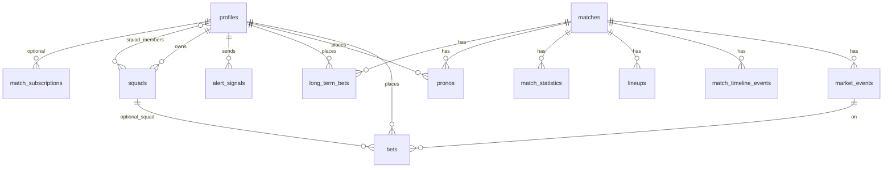

# PROJECT_STATE — VAR Time

> Documentation vivante. Ne documente que le **code et le schéma présents** dans ce dépôt (pas la roadmap produit seule).
>
> **Dernière mise à jour : Sprint Audit UX & Robustesse — Optimistic UI, Trust Score, PWA Offline, Sécurisation Pronos.**

---

## 🎯 Vision du MVP (rappel)

**VAR Time** — PWA mobile-first « second écran » foot : signaux communautaires (mécanique type Waze), paris instantanés sur le verdict, pronostics avant match, ligue privée par match. Ton tutoiement / MPG. Monnaie virtuelle « Pts » (`sifflets_balance`), pas d’argent réel.

---

## 🏗️ Architecture technique

| Couche             | Choix                                           | Détails                                                                                                                                                                                                                                                                     |
| ------------------ | ----------------------------------------------- | --------------------------------------------------------------------------------------------------------------------------------------------------------------------------------------------------------------------------------------------------------------------------- |
| Front              | **Next.js 16** (App Router)                     | Server Components par défaut, `"use client"` ciblé.                                                                                                                                                                                                                         |
| UI                 | **React 19** + **Tailwind v4** + `lucide-react` | Tokens : `pitch-*`, `chalk`, `whistle`.                                                                                                                                                                                                                                     |
| Toasts             | `sonner`                                        | Monté dans le layout racine.                                                                                                                                                                                                                                                |
| Auth & DB          | **Supabase** (`@supabase/ssr`)                  | Google OAuth PKCE ; middleware refresh JWT.                                                                                                                                                                                                                                 |
| Realtime           | Supabase                                        | Tables avec **`REPLICA IDENTITY FULL`** + publication : `matches`, `market_events`, `bets`, `match_timeline_events`, `profiles`, `match_statistics`, `user_badges`, **`alert_signals`** (voir `0004`–`0006`, `0012`–`0013`, `0035`, `0022`, **`0047`**).                    |
| Données live       | **API-Football** (v3 api-sports.io)             | Client [`src/lib/api-football-client.ts`](src/lib/api-football-client.ts), sync [`src/services/api-football-sync.ts`](src/services/api-football-sync.ts), import calendrier [`src/services/api-football-fixtures-import.ts`](src/services/api-football-fixtures-import.ts). |
| Données cosmétique | **TheSportsDB**                                 | Calendrier / assets ; ne doit pas écraser le nom compétition si `api_football_league_id` est posé ([`src/services/sportsdb-sync.ts`](src/services/sportsdb-sync.ts)).                                                                                                       |
| Admin              | `service_role`                                  | [`src/lib/supabase/admin.ts`](src/lib/supabase/admin.ts).                                                                                                                                                                                                                   |
| API shape          | `{ ok, data \| error }`                         | [`src/lib/api-response.ts`](src/lib/api-response.ts).                                                                                                                                                                                                                       |

**Clients Supabase typés** : `server.ts`, `client.ts`, `admin.ts` — générique `Database` depuis [`src/types/database.ts`](src/types/database.ts).

---

## 🗄️ Schéma de données (état des migrations)

**Fichiers SQL** : `supabase/migrations/0001_init.sql` → **`0047_alert_signals_replica_full.sql`** (47 migrations versionnées).

### Tables & objets notables (post-0033)

| Migration | Contenu                                                                                                                                                                                                                                                                                                                                                                                                                                                                                                                                                                                                                                                        |
| --------- | -------------------------------------------------------------------------------------------------------------------------------------------------------------------------------------------------------------------------------------------------------------------------------------------------------------------------------------------------------------------------------------------------------------------------------------------------------------------------------------------------------------------------------------------------------------------------------------------------------------------------------------------------------------- |
| **0032**  | `competitions.api_football_league_id` (UNIQUE partiel).                                                                                                                                                                                                                                                                                                                                                                                                                                                                                                                                                                                                        |
| **0033**  | `matches.round_short`, `matches.has_lineups`.                                                                                                                                                                                                                                                                                                                                                                                                                                                                                                                                                                                                                  |
| **0034**  | `matches.last_events_sync_at` (horodatage sync événements — mis à jour côté sync, voir `api-football-sync.ts`).                                                                                                                                                                                                                                                                                                                                                                                                                                                                                                                                                |
| **0035**  | `match_statistics` + index + Realtime `REPLICA IDENTITY FULL`.                                                                                                                                                                                                                                                                                                                                                                                                                                                                                                                                                                                                 |
| **0036**  | `profiles` : `xp`, `avatar_url`, `rank`, `updated_at` (affichage `rank` dans [`TopBar`](src/components/layout/TopBar.tsx) / layout app).                                                                                                                                                                                                                                                                                                                                                                                                                                                                                                                       |
| **0037**  | `pronos` + RLS + RPC **`place_prono`** (insert gratuit, pas de débit solde).                                                                                                                                                                                                                                                                                                                                                                                                                                                                                                                                                                                   |
| **0038**  | Parimutuel global + premier modèle braquage (`bets.room_id` → `rooms` par match).                                                                                                                                                                                                                                                                                                                                                                                                                                                                                                                                                                              |
| **0039**  | Types `market_events` / `alert_signals` : ajout `free_kick`, `corner` (noms alignés `penalty_check`, `var_goal`, …).                                                                                                                                                                                                                                                                                                                                                                                                                                                                                                                                           |
| **0040**  | `match_subscriptions` (PK `user_id`, `match_id`, `smart_mute`) — RLS « own row » ; typée dans **`database.ts`** ; UI cloche **`MatchNotificationBell`** dans **`LiveRoom`** + **`POST /api/match-subscription`**.                                                                                                                                                                                                                                                                                                                                                                                                                                              |
| **0041**  | **Squads persistantes** : tables `squads` (`owner_id`, pas de `match_id`) + `squad_members` ; migration données `rooms` → `squads` ; `bets.room_id` → **`bets.squad_id`** ; **`place_bet(..., p_squad_id)`** (vérif membre) ; **`resolve_event_parimutuel`** : braquage par **`squad_id`** sur l’événement (pot perdants de la squad → gagnants de la même squad sur le même `event_id`). RLS `squad_members` SELECT = **ligne du user uniquement** + RPC **`squad_members_for_my_squads`** + **`squad_by_invite_code`** (rejoindre par code). **Idempotente** (rejouable : `CREATE IF NOT EXISTS`, copie `rooms` / colonne `room_id` seulement si présentes). |
| **0042**  | `lineups.shirt_number` (texte, API-Football `player.number`) ; rempli par **`syncMatchLineups`** ; terrain [`MatchLineupsPitch`](src/components/match/MatchLineupsPitch.tsx) affiche le numéro dans la pastille (fallback initiales).                                                                                                                                                                                                                                                                                                                                                                                                                          |
| **0043**  | **Correctif RLS** : recréation de `squad_members_select_visible` (sans lecture de `squads`) + **`squad_members_for_my_squads()`** si la base a été migrée avec l’ancienne 0041 (récursion infinie).                                                                                                                                                                                                                                                                                                                                                                                                                                                            |
| **0044**  | RPC **`squad_by_invite_code(p_invite)`** — résout une ligue privée par code d’invitation (SECURITY DEFINER) : le SELECT direct sur `squads` est masqué par RLS pour un non-membre ; [`POST /api/squads/join`](src/app/api/squads/join/route.ts) utilise cette RPC. _(Également ajoutée en fin de bloc squads dans la 0041 pour les installs complètes.)_                                                                                                                                                                                                                                                                                                       |
| **0045**  | **`resolve_match_pronos(match_id)`** (SECURITY DEFINER, `service_role` uniquement) : match `finished` + scores → pronos `pending` → `won`/`lost`, crédit **`reward_amount`** + **45 XP** + **`rank = profile_rank_from_xp(xp)`** ; idempotent. **`profile_rank_from_xp`** : seuils 500 / 2000 / 5000 XP. **`resolve_event_parimutuel`** : **30 XP** + rank par pari gagné ; **8 XP** + rank sur bonus braquage. Appel depuis [`syncApiFootballMatch`](src/services/api-football-sync.ts) (match `finished`) et [`finish-match`](src/app/api/admin/finish-match/route.ts).                                                                                      |
| **0046**  | **`place_prono`** : après insert `pronos`, **`INSERT … match_subscriptions` ON CONFLICT DO NOTHING** (auto-abonnement « smart notif » sans écraser un mute existant).                                                                                                                                                                                                                                                                                                                                                                                                                                                                                          |
| **0047**  | **`alert_signals`** : **`REPLICA IDENTITY FULL`** (événements Realtime complets pour clients filtrant hors PK).                                                                                                                                                                                                                                                                                                                                                                                                                                                                                                                                                |

### RPC métier (SECURITY DEFINER) — présents dans `database.ts`

- `place_bet(p_event_id, p_chosen_option, p_amount_staked, p_multiplier, p_squad_id)` — débit + insert ; `squad_id` optionnel (oblige à être membre de la squad si renseigné).
- **`squad_members_for_my_squads()`** — liste `squad_id` / `user_id` des membres des squads dont l’utilisateur est membre ou propriétaire (appelée par [`GET /api/squads`](src/app/api/squads/route.ts), contourne la RLS restrictive sur `squad_members`).
- **`squad_by_invite_code(p_invite)`** — retourne la ligne `squads` pour un code valide (rejoindre une ligue privée).
- **`resolve_match_pronos(p_match_id)`** — résolution post-match des lignes `pronos` + crédit Sifflets / XP / `rank`.
- **`profile_rank_from_xp(p_xp)`** — libellé de grade (aligné landing kop).
- `get_event_odds(p_event_id)` — lecture parimutuel ; consommé par **`VotingModal`** (poll 2 s) et **`POST /api/bet`** (validation du multiplicateur).
- `place_prono(...)` — pronos gratuits.
- `place_long_term_bet` / `resolve_long_term_bets` — **schéma SQL hérité (0017 / 0021)** ; **`resolve_long_term_bets`** encore appelée depuis [`finish-match`](src/app/api/admin/finish-match/route.ts) pour d’éventuelles lignes legacy. **Plus de routes** `/api/long-term-bet` ni `/api/long-term-odds` ; profil = **`pronos`** + paris VAR.
- **`resolve_event_parimutuel`** — appelé depuis [`resolve-event.ts`](src/lib/resolve-event.ts) (admin) : parimutuel global + **braquage par squad** sur l’événement (0041). L’ancienne RPC `resolve_event` peut subsister en base pour compat ; le flux produit utilise le parimutuel.
- Trigger auth → `profiles` + solde initial (cf. migrations init / extras).

### Diagramme relationnel (simplifié)



---

## 🔄 Synchronisation API-Football & cron **match-monitor**

### Fonctions serveur ([`api-football-sync.ts`](src/services/api-football-sync.ts))

- **`syncMatchEvents(matchId)`** — `GET /fixtures/events` → upsert `match_timeline_events` ; puis **[`applyApiFootballSignalsToMarkets`](src/lib/sports/api-football-market-bridge.ts)** (ouverture / résolution **`var_goal`** et **`penalty_check`** d’après les incidents `Var` / pénalty) ; met à jour **`last_events_sync_at`** sur `matches` en succès.
- **`syncMatchStatistics(matchId)`** — `GET /fixtures/statistics` → upsert `match_statistics` ; met **`last_stats_sync_at`** sur `matches`.
- **`syncMatchLineups(matchId)`** — `GET /fixtures/lineups` → `lineups` (dont **`shirt_number`** depuis `player.number`) + **`has_lineups`** / données équipe sur `matches`.
- **`syncApiFootballMatch(matchId)`** — orchestrateur fin de match : fixture + lineups + events + stats en chaîne (délais internes) ; utilisé aussi par admin / `syncLiveMatches` (plafonné).

Helpers : `patchMatchFromFixtureRow`, `mapApiFootballFixtureStatusShort`, mapping statuts API → `MatchStatus`, etc.

### [`GET /api/cron/match-monitor`](src/app/api/cron/match-monitor/route.ts)

**Auth** : `Authorization: Bearer <CRON_SECRET>`.

**Sélection** : matchs `upcoming` avec `start_time` dans une fenêtre (bientôt + léger rétro) **ou** matchs `first_half` / `half_time` / `second_half` / `paused`, tous avec `api_football_id` non null.

**À chaque exécution (~1 min)** :

1. **Batch fixtures** (`/fixtures?ids=…`, paquets de 20) → mise à jour score, minute, statut interne via `patchMatchFromFixtureRow`.
2. **Events** : pour chaque match dont le statut API court est dans `LIVE_STATUS_SHORT` (`1H`, `2H`, `HT`, …), appel **`syncMatchEvents`** ; délai inter-match configurable `MATCH_MONITOR_EVENTS_DELAY_MS` (défaut 200 ms).
3. **Stats** : sur les mêmes matchs live, si **`last_stats_sync_at`** absent ou &gt; **5 minutes** → **`syncMatchStatistics`**.
4. **Lineups backfill** : si **`has_lineups`** faux et (coup d’envoi dans **45 min** ou match déjà en jeu) → **`syncMatchLineups`**.
5. **Fin** : si statut API ∈ `FT`, `AET`, `PEN`, … → **`syncApiFootballMatch`** (sync complète une fois).

**Réponse JSON** : compteurs `fixtureApiCalls`, `matchesPatchedFromFixture`, `eventsSyncCount`, `statsSyncCount`, `lineupBackfillCount`, `fullSyncOnEndCount`, `errors[]`.

> **Précision** : il n’existe **pas** dans ce fichier de branche « score changé → `syncApiFootballMatch` immédiat » ; le rafraîchissement timeline/stats repose sur les **étapes 2–3** en boucle cron + `syncMatchEvents` / heartbeat stats.

### Autres entrées sync

- [`GET /api/admin/sync-apifootball-fixtures`](src/app/api/admin/sync-apifootball-fixtures/route.ts) — par date (ligues suivies lobby).
- [`GET /api/admin/sync-apifootball-round`](src/app/api/admin/sync-apifootball-round/route.ts) — `leagueId` + `roundName` (libellé API).
- [`GET /api/admin/sync-live`](src/app/api/admin/sync-live/route.ts) — `syncLiveMatches` (quota, throttle).

---

## 🖥️ Composants & routes UI actifs

### Lobby

- [`src/app/(app)/lobby/page.tsx`](<src/app/(app)/lobby/page.tsx>) — `searchParams` `league` + `round` → `fetchLobbyMatchesByRound` ; sinon **`fetchLobbyMatchesForParisDayWithFallback`** : **football day** (date Paris de `now − 4h`, voir [`paris-day.ts`](src/lib/paris-day.ts)) puis requête légère + jour civil Paris du prochain coup d’envoi si 0 match ; bandeau **« Aujourd’hui : repos »** dans [`MatchLobby`](src/components/lobby/MatchLobby.tsx).
- [`src/components/lobby/MatchLobby.tsx`](src/components/lobby/MatchLobby.tsx) — onglets **Direct** (live ou upcoming avec compos), **Top 5**, **Europe** ; groupes par ligue ; lien « Toute la {round_short} → ».
- [`src/components/lobby/MatchCard.tsx`](src/components/lobby/MatchCard.tsx) — layout MPG optionnel ; noms `line-clamp-2` ; minute live en badge rouge imposant ; ligne buteurs en scroll horizontal masqué.
- Constantes ligues : [`src/lib/constants/top-leagues.ts`](src/lib/constants/top-leagues.ts) — **5 championnats + 3 coupes UEFA** (8 compétitions suivies au sens « IDs » ; onglet Europe = agrégé).

### Page match

- [`src/app/(app)/match/[id]/page.tsx`](<src/app/(app)/match/[id]/page.tsx>) — `LiveRoom` + solde + modérateur.
- [`src/components/match/LiveRoom.tsx`](src/components/match/LiveRoom.tsx) — onglets **Kop** / **Compo** / **Pronos** (si `upcoming`) ou **Stats** (sinon) ; Realtime `matches`, `market_events`, `bets` ; `VotingModal` si event ouvert ; **squad active** via [`useActiveSquad`](src/hooks/useActiveSquad.ts) (localStorage) → `squad_id` envoyé à [`/api/bet`](src/app/api/bet/route.ts) ; **cloche** [`MatchNotificationBell`](src/components/match/MatchNotificationBell.tsx) (`match_subscriptions` + [`POST /api/match-subscription`](src/app/api/match-subscription/route.ts)).
- [`MatchTimeline.tsx`](src/components/match/MatchTimeline.tsx) — remplacements : entrant / sortant (`details` JSON `assist` + `player_name`) avec flèches **ArrowUpRight** / **ArrowDownRight**. [`MatchLineups.tsx`](src/components/match/MatchLineups.tsx) + [`MatchLineupsPitch.tsx`](src/components/match/MatchLineupsPitch.tsx) — pastilles terrain = **`shirt_number`** si présent (0042). [`MatchStats.tsx`](src/components/match/MatchStats.tsx) — stats Realtime ; couleurs club.
- [`PolymarketTab.tsx`](src/components/match/PolymarketTab.tsx) — pronos gratuits RPC `place_prono` (côté DB **0046** : auto-ligne `match_subscriptions` si pas déjà abonné) ; **Bunker 0-0** : bloc plein écran « drama » (masque la grille buteurs), récompense dédiée.
- Alignement vertical des contenus d’onglets **`mt-6`** ; shell **`bg-zinc-950`** (body + pages lobby / match).
- [`VotingModal.tsx`](src/components/match/VotingModal.tsx) — timer 90 s, cotes **parimutuel** (`get_event_odds`), **slider + presets MIN/MOITIÉ/ALL IN**, **deux gros boutons** OUI/NON ; mention **« Braquage actif avec [nom] »** si squad sélectionnée.
- [`ActionDrawer.tsx`](src/components/match/ActionDrawer.tsx) — alertes (types 0039), modération timeline, états match, sync TSDB.
- **Ligues (squads)** : page [`/(app)/ligues`](<src/app/(app)/ligues/page.tsx>) + onglets **Mes ligues / Créer / Rejoindre** [`LiguesPageClient`](src/components/ligues/LiguesPageClient.tsx) ; détail [`/ligues/[squadId]`](<src/app/(app)/ligues/[squadId]/page.tsx>) + [`SquadDetailClient`](src/components/ligues/SquadDetailClient.tsx) (classement XP + Pts, pot commun). API [`GET/POST /api/squads`](src/app/api/squads/route.ts), [`GET /api/squads/[squadId]`](src/app/api/squads/[squadId]/route.ts), [`join`](src/app/api/squads/join/route.ts), [`leave`](src/app/api/squads/leave/route.ts). Ancienne URL **`/squads`** → redirect **`/ligues`**. [`BottomNav`](src/components/layout/BottomNav.tsx) : lien **Ligues** → `/ligues` (remplacé par le Super-Bouton sur match en direct).

### Autres pages app notables

- **Profil** [`(app)/profile`](<src/app/(app)/profile/page.tsx>) — onglets **Paris VAR** / **Pronos** / **Trophées** ; badges [`badges.ts`](src/app/actions/badges.ts) alignés sur **`pronos`** pour score exact / buteur gagnants.
- **Admin résolution** [`admin/resolve`](src/app/admin/resolve/page.tsx) — événements **`market_events`** ouverts uniquement (plus de panneau paris long terme).
- Leaderboard, règles, login, landing `/` ([`src/app/page.tsx`](src/app/page.tsx)) — VAR Time, tutoiement, hero + blocs gameplay, grades kop conservés.

---

## ✅ Ce qui est implémenté et branché (résumé « prod code »)

- Auth Google + garde middleware `/lobby`, `/match/*`, `/squads`, `/ligues`, `/profile`, `/leaderboard`.
- Lobby **8 ligues** (IDs Top 5 + UEFA), jour Paris, vue **`?league=&round=`** + `round_short` / `has_lineups`.
- Cron **`match-monitor`** : fixtures batch + events live + heartbeat stats 5 min + backfill lineups + sync full FT.
- **Stats match** en direct : table + UI + Realtime après sync.
- **Timeline** + lineups API-Football ; terrain **`MatchLineupsPitch`**.
- **Paris court terme** `place_bet` avec **`squad_id`** optionnel (membre vérifié en RPC) ; **`VotingModal`** (slider + one-tap, cotes **parimutuel** via RPC **`get_event_odds`**, piège à focus + `role="dialog"` / ARIA) ; résolution + **braquage par squad** via **`resolve_event_parimutuel`** (0041).
- **Pronos** avant match (`pronos` + `place_prono`) dans **`PolymarketTab`** (score exact + buteur, variante Bunker 0-0) ; **résolution** : RPC **`resolve_match_pronos`** à la fin du match (`syncApiFootballMatch` / admin **finish-match**), crédit **`reward_amount`** + XP + grade.
- **Squads persistantes** : création / rejoindre / quitter sur **`/ligues`** (onglets + pot commun + lien classement) ; squad active en local → paris match avec braquage intra-squad sur l’événement.
- **Profil** : solde **`sifflets_balance`**, historique **Paris VAR + Pronos** ([`ProfileClient`](src/components/profile/ProfileClient.tsx)), refill, badges, `rank` DB dans la topbar.
- **PWA** : fichier statique [`public/sw.js`](public/sw.js) + enregistrement client [`ServiceWorkerRegister`](src/components/providers/ServiceWorkerRegister.tsx) dans le layout racine ; `manifest.webmanifest` inchangé.
- **Types d’alertes** étendus (`free_kick`, `corner`) alignés `market_events` / `alert_signals` (0039) — **à vérifier** cohérence avec libellés UI du drawer vs contraintes SQL historiques si anciennes données.

---

## 🚧 Écarts, incomplets ou sans câblage UI

| Sujet                                  | État réel                                                                                                                                                                                                                                                                                  |
| -------------------------------------- | ------------------------------------------------------------------------------------------------------------------------------------------------------------------------------------------------------------------------------------------------------------------------------------------ |
| **`match_subscriptions`** (0040)       | **Branché** : auto via **`place_prono` (0046)** ; cloche **`LiveRoom`** + **`POST /api/match-subscription`** ; push serveur via **`push-sender.ts`** + VAPID ; opt-in déclenché au premier prono.                                                                                          |
| **`get_event_odds`**                   | **Branché** : `VotingModal` + validation côté **`/api/bet`**.                                                                                                                                                                                                                              |
| **Résolution des `pronos`**            | **Fait (0045)** : `resolve_match_pronos` + appel sync fin de match ; buteur = événement timeline `goal` (nom normalisé).                                                                                                                                                                   |
| **`long_term_bets` (legacy)**          | Table + RPC encore en base ; **plus** d’API ni d’UI profil — remplacé par **`pronos`**.                                                                                                                                                                                                    |
| **Vérification auto résolution event** | [`sportsProvider.ts`](src/lib/sports/sportsProvider.ts) interroge **API-Football** (`fetchFixtureEventsRaw`) pour **`var_goal`** / **`penalty_check`** ; sinon `WAIT` (admin / autre flux).                                                                                                |
| **Déclencheur VAR / pénalty auto**     | **Fait** : heuristiques sur incidents `fixtures/events` dans **`applyApiFootballSignalsToMarkets`** (appelée depuis **`syncMatchEvents`**) + signaux communautaires **`/api/alert`** inchangés.                                                                                            |
| **Tests E2E**                          | [`tests/e2e/user-journey.spec.ts`](tests/e2e/user-journey.spec.ts) : **PWA `sw.js`**, lobby, **Kop / Compo / Pronos \| Stats**, **Pronos** + **Bunker 0-0**, profil **Confiance** + **Paris VAR**. Exécution locale : aligner **`PLAYWRIGHT_BASE_URL`** sur le port du dev (voir § Tests). |
| **`match_minute`**                     | Alimentée via sync API-Football sur `matches` ; pas de « chronomètre » autonome côté app hors données fournisseur.                                                                                                                                                                         |

---

## 🧪 Tests & commandes

```bash
npm run dev
npm run build
npm run lint && npm run typecheck
npm run test:backend   # scripts/simulate-match-scenario.ts
npm run test:e2e       # Playwright — libellés Kop / Compo / Pronos / Bunker 0-0
```

**E2E** : `PLAYWRIGHT_BASE_URL` doit pointer vers l’URL réelle du `npm run dev` (y compris le **port**, ex. `http://localhost:3002` si `PORT=3002`). Sinon le `webServer` Playwright tente un second Next et échoue. Si le **global setup** échoue sur `/api/test/auth` avec `fetch failed`, vérifier réseau + `NEXT_PUBLIC_SUPABASE_URL` / `SUPABASE_SERVICE_ROLE_KEY` accessibles depuis ce serveur.

Script SQL utilitaire : `supabase/audit_pending_bets.sql`.

---

## 📌 Next Steps (backlog — **VAR TIME economy**)

1. **Avatars personnalisés** — `avatar_url` en UI profil (`` dans TopBar + SquadDetail) ; upload via Storage Supabase ou URL externe.
2. **Classement global ("Board des sifflets")** — vue publique des meilleurs `sifflets_balance` / XP, mise à jour quotidienne.
3. **Migrations SQL en attente (prod)** — appliquer **`0055_fix_place_match_prono.sql`** (fix `match_subscriptions`) et **`0056_squad_nudges.sql`** dans l’éditeur SQL Supabase.
4. **`long_term_bets` (legacy)** — option DROP si plus aucune ligne en base.

---

---

## 📋 Sprints terminés (résumé des ajouts)

### Sprint Audit UX & Robustesse (Mai 2026)

- **Optimistic UI** : paris dans `VotingModal` verrouillés visuellement avant la réponse serveur.
- **RSA du Parieur** : route `/api/claim-rsa` — recrédite 50 Sifflets si solde < 10.
- **Transparence Parimutuel** : labels `~Cote` + infobulle dans `VotingModal`.
- **Trust Score** : migration `0051_trust_score.sql` — +2 pts sur alerte vraie, -5 sur fake.
- **PWA Offline** : `sw.js` mise en cache, `public/offline.html`, `public/icon.svg`, `manifest.webmanifest`.
- **Splash Screen** : `loading.tsx` pour les routes `(app)` et racine.
- **CTA VAR (BottomNav)** : icône `MonitorPlay` + label "LA VAR" ; masqué si match non en direct.
- **Optimisation Desktop** : `max-w-md mx-auto` sur le layout root (aspect mobile sur grand écran).
- **Verrouillage Pronos** : champs grecs si `match.status !== "upcoming"` côté UI + RPC.
- **PWA Install Prompt** : bandeau toast + bouton fermeture (croix) sur `InstallPrompt`.

### Sprint Rétention & Social — Notifications Push (Mai 2026)

- **Infrastructure VAPID** (`0011_push_subscriptions.sql`) : table `push_subscriptions` + opt-in à la première action → `POST /api/push-subscribe`.
- **Utilitaire push serveur** [`src/lib/push-sender.ts`](src/lib/push-sender.ts) — `sendPushToMatchSubscribers` / `sendPushToUsers` (nettoie les endpoints 410 expirés).
- **Alertes VAR push** : `/api/alert` déclenche un push aux abonnés du match au moment de l'ouverture d'un `market_event`.
- **Smart Mute SW** : `sw.js` vérifie `clients.matchAll` — skip notif si app ouverte en premier plan.
- **Nudge Pronos** (`POST /api/squads/nudge`) : envoie un push aux membres de la ligue sans prono sur les matchs à venir ; cooldown 30 min par squad (table `squad_nudge_logs`, migration **`0056`**) ; bouton « Nudge pronos » dans [`SquadDetailClient`](src/components/ligues/SquadDetailClient.tsx).
- **Sirène VAR** (`POST /api/squads/var-alert`) : panic button dans [`LiveRoom`](src/components/match/LiveRoom.tsx) (onglet Kop, si match en direct) ; push à tous les membres de la ligue de l'utilisateur ; cooldown 15 min par user (même table `squad_nudge_logs`).

### Hub Statistiques de Ligue (Mai 2026)

- Tables **`league_standings`** + **`league_top_players`** (migration **`0048`**) — alimentées par [`scripts/import-league-history.ts`](scripts/import-league-history.ts).
- Composants [`LeagueHub`](src/components/lobby/LeagueHub.tsx), [`LeagueStandingsTable`](src/components/lobby/LeagueStandingsTable.tsx), [`TopPlayersList`](src/components/lobby/TopPlayersList.tsx) — onglets Résultats / Classement / Buteurs / Passeurs intégrés dans [`MatchLobby`](src/components/lobby/MatchLobby.tsx) (onglets Top 5 et Europe).

---

_Fin du document — mise à jour 2026-05-05 (sprint Rétention & Social)._
