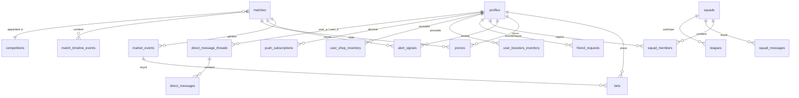
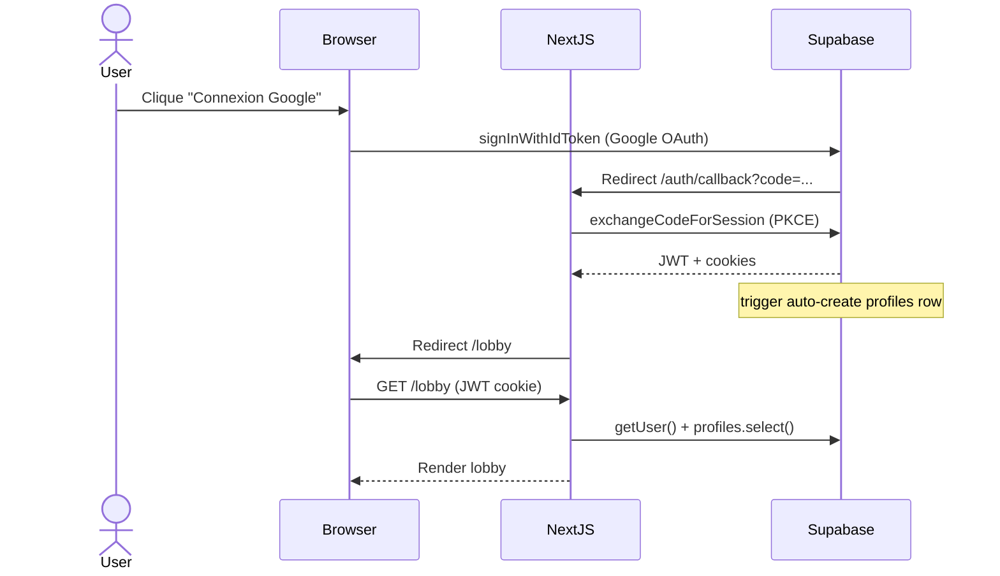
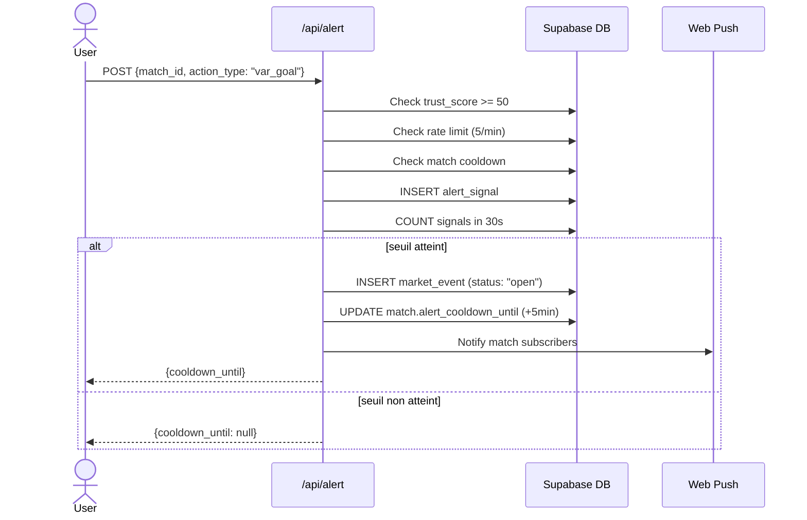
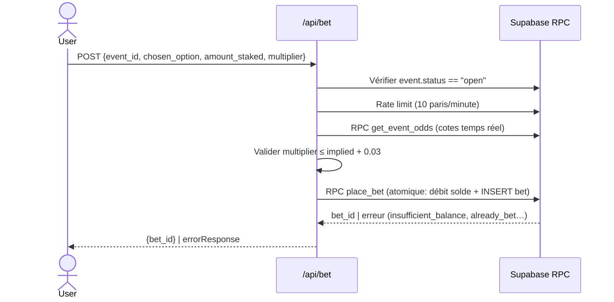
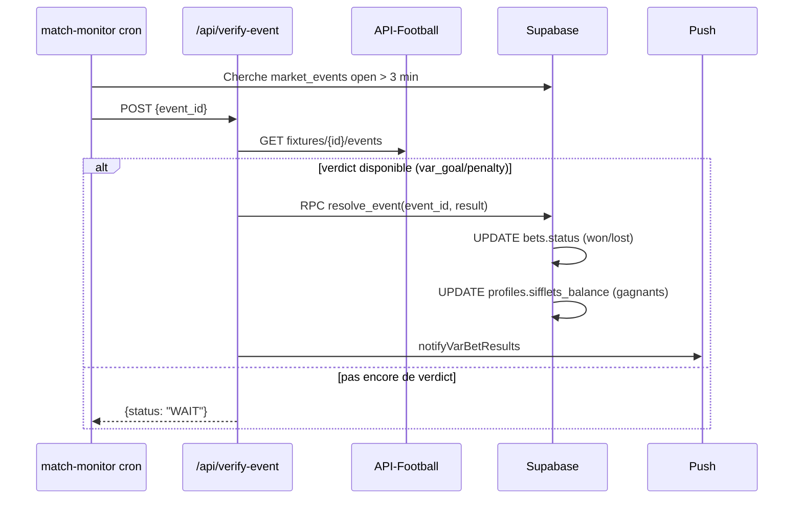
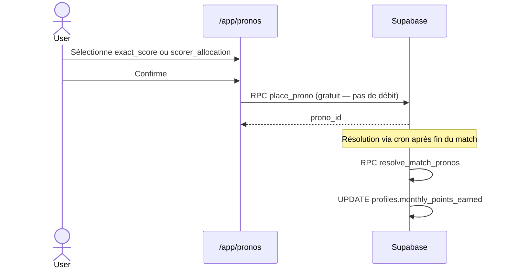

# 02 — Audit Rulesbook (Logique métier & Features)

> Branche : `stage` — 2026-05-11

---

## 2.1 Glossaire métier

| Entité                       | Définition                                                                                                                 |
| ---------------------------- | -------------------------------------------------------------------------------------------------------------------------- |
| **Sifflets**                 | Monnaie virtuelle dépensable pour les paris VAR. Solde initial 1000. Recharge quotidienne de 500 si solde < 500.           |
| **Points**                   | Score de classement accumulé (lifetime, monthly, season). Gagné via paris VAR gagnants et pronostics. Non dépensable.      |
| **XP**                       | Expérience de progression de rang (user → bronze → argent → boss…).                                                        |
| **VAR Event / Market Event** | Événement de pari en direct déclenché par la communauté (ex. "But sous VAR"). Durée 90s, parimutuel.                       |
| **Prono**                    | Pronostic gratuit placé avant match (score exact, buteur, allocation buts/joueur). Résolution auto.                        |
| **Squad / Ligue**            | Groupe de joueurs avec classement interne, chat, et pronostics partagés.                                                   |
| **Booster**                  | Consommable acheté avec des Points : `double_xp`, `cote_plus`, `safety_net`, `vision`.                                     |
| **Trust Score**              | Karma communautaire (mécanique Waze) — détermine le seuil d'accès aux alertes VAR.                                         |
| **Alerte**                   | Signal envoyé par un joueur sur un événement de match (penalty, VAR, carton rouge…). Déclenche un marché si seuil atteint. |
| **Streak**                   | Série de connexions consécutives. Protégeable par un Streak Freeze.                                                        |

### Relations entre entités

---

## 2.2 Inventaire exhaustif des features

| Feature                      | État   | Fichiers clés                                                                                  | Règles métier                                                              | Tests             |
| ---------------------------- | ------ | ---------------------------------------------------------------------------------------------- | -------------------------------------------------------------------------- | ----------------- |
| Auth Google OAuth            | `prod` | `src/app/auth/callback/route.ts`, `src/components/auth/SignInWithGoogleButton.tsx`             | PKCE, cookie HTTPOnly                                                      | E2E partial       |
| Login streak + freeze        | `prod` | `src/app/(app)/layout.tsx:13`                                                                  | +1/jour si hier, freeze consomme un Freeze Freeze                          | ❌                |
| Match lobby                  | `prod` | `src/app/(app)/lobby/page.tsx`, `src/lib/lobby-queries.ts`                                     | Matchs triés par heure, filtrés par ligues préférées                       | ❌                |
| Match room (Live Room)       | `prod` | `src/components/match/LiveRoom.tsx`                                                            | 4 subscriptions Realtime, tabs kop/compo/stats/vestiaire                   | ❌                |
| Système d'alertes VAR (Waze) | `prod` | `src/app/api/alert/route.ts`                                                                   | Seuil dynamique par audience, cooldown 5 min, trust_score >= 50            | ❌                |
| Paris VAR parimutuel         | `prod` | `src/app/api/bet/route.ts`, `src/lib/odds.ts`                                                  | 90s window, 1 pari/user/event, min 10 sifflets, multiplicateur vérifié     | 🟡 (scorer logic) |
| Pronostics avant-match       | `prod` | `src/app/(app)/pronos/page.tsx`, `supabase/migrations/0037_pronos.sql`                         | Gratuit, exact_score + scorer_allocation, résolution auto via cron         | 🟡 (slots)        |
| Résolution VAR auto          | `prod` | `src/app/api/verify-event/route.ts`, `src/lib/resolve-event.ts`                                | Age > 3 min → vérifie API-Football → résout si var_goal/penalty_check      | ❌                |
| Résolution VAR manuelle      | `prod` | `src/app/api/admin/resolve-event/route.ts`                                                     | Admin only, logué dans audit_log                                           | ❌                |
| Notifications push (VAPID)   | `prod` | `src/lib/push-sender.ts`, `src/app/api/push/subscribe/route.ts`                                | Budget 3 critiques/jour/user, toggles notif par type                       | ❌                |
| Squads / Ligues              | `prod` | `src/app/(app)/ligues/page.tsx`, `src/app/api/squads/`                                         | Classement interne, chat temps réel, invite via code                       | ❌                |
| Chat squad                   | `prod` | `src/components/ligues/SquadChat.tsx`, `supabase/migrations/0093_squad_chat_system.sql`        | Messages temps réel, badges non-lus                                        | ❌                |
| Messages directs             | `prod` | `src/app/(app)/messages/`, `supabase/migrations/0098_direct_messages.sql`                      | Threads 1:1, badges non-lus                                                | ❌                |
| Amis                         | `prod` | `src/app/api/friend-requests/route.ts`, `supabase/migrations/0063_friends.sql`                 | Requête + accept/reject                                                    | ❌                |
| Pronos entre amis            | `prod` | `src/app/api/pronos/friend-hints/route.ts`                                                     | Voir pronos des amis sur un match                                          | ❌                |
| Boutique cosmétique          | `prod` | `src/app/(app)/shop/page.tsx`, `supabase/migrations/0089_shop.sql`                             | avatar/border/effect, achat avec Points ou débloqué par rang               | ❌                |
| Boosters                     | `prod` | `src/app/api/boosters/`, `supabase/migrations/0090_boosters.sql`                               | double_xp, cote_plus, safety_net, vision — consommables 1 shot             | ❌                |
| Classement mensuel           | `prod` | `src/app/(app)/leaderboard/page.tsx`, `supabase/migrations/0074_monthly_leaderboard.sql`       | Reset mensuel via cron                                                     | ❌                |
| Streaks de connexion         | `prod` | `src/app/(app)/layout.tsx:38`, `supabase/migrations/0065_login_streak.sql`                     | Streak freeze protège la série                                             | ❌                |
| Badges gamification          | `prod` | `src/components/profile/BadgeUnlockListener.tsx`, `supabase/migrations/0022_badges.sql`        | Déverrouillés par critères (winrate, streak, paris…)                       | ❌                |
| Refill quotidien             | `prod` | `src/app/api/refill/route.ts`                                                                  | Si solde < 500, recharge de 500 sifflets, 1/jour                           | ❌                |
| Mode braquage squad          | `prod` | `supabase/migrations/0064_league_mode.sql`, `supabase/migrations/0038_parimutuel_braquage.sql` | game_mode IN ('classic', 'braquage')                                       | ❌                |
| Contre-pied bonus            | `prod` | `supabase/migrations/0059_contre_pied_bonus.sql`                                               | Bonus rare/très-rare/méga-rare/ultra-rare sur vote minoritaire gagnant     | ❌                |
| Saison / Transition          | `prod` | `supabase/migrations/0081_seasons.sql`, `src/app/api/cron/transition-season/route.ts`          | Saison courante, reset season_points, overlay NewSeason                    | ❌                |
| Recap quotidien              | `prod` | `src/app/api/cron/daily-digest/route.ts`                                                       | Push récap quotidien des résultats                                         | ❌                |
| Twitter/X live               | `beta` | `src/lib/twitter.ts`, `src/app/api/cron/twitter-live/route.ts`                                 | Tweet auto lors d'événements VAR — clés Twitter absentes de `.env.example` | ❌                |
| Page Discover                | `prod` | `src/app/discover/page.tsx`                                                                    | Landing SEO (robots: noindex)                                              | ❌                |
| Press outreach               | `prod` | `src/app/admin/press-outreach/page.tsx`, `/api/admin/generate-outreach`                        | Génère un email de presse via IA — admin uniquement                        | ❌                |

---

## 2.3 Règles métier détaillées

### Économie des Sifflets

- **Solde initial** : 1000 sifflets (`supabase/migrations/0001_init.sql:12`)
- **Recharge** : +500 si solde < 500, 1 fois/jour (`src/lib/constants/economy.ts:1`, `src/app/api/refill/route.ts`)
- **Mise minimum** : tiered selon solde — de 5 à 1000 sifflets selon paliers (`src/lib/economy/min-bet.ts:1`)
- **Paris VAR** : débit atomique via RPC `place_bet` avec row-level locking — impossible de sur-miser
- **Solde négatif** : impossible — contrainte `CHECK (sifflets_balance >= 0)` + RPC vérifie `insufficient_balance`

### Mécanique d'alerte VAR (Waze)

- Seuil d'alerte : dynamique selon audience active (1 signal si ≤ 5 users, 5 signals si > 100) (`src/lib/constants/alert.ts:8`)
- Trust score minimum : 50 (`src/lib/constants/alert.ts:4`) — retour silencieux si insuffisant (anti-troll sans exposer le motif)
- Fenêtre de détection : 30 secondes (`ALERT_WINDOW_SECONDS = 30`)
- Cooldown match : 5 minutes après un marché créé (`COOLDOWN_MINUTES = 5`)
- Rate limit utilisateur : 5 alertes/minute, silencieux

### Paris VAR parimutuel

- Fenêtre de vote : **90 secondes** (`LIVE_BETTING_WINDOW_SECONDS` — source non localisée dans ce scope)
- 1 seul pari par user par événement (UNIQUE constraint sur `bets(user_id, event_id)`)
- Cote validée côté serveur avec tolérance `±0.03` pour les décalages réseau (`src/app/api/bet/route.ts:6`)
- Contre-pied bonus : multiplicateur rare si vote minoritaire gagnant (migration `0059`)

### Pronostics

- Gratuits (pas de débit de sifflets)
- Types : `exact_score`, `scorer_allocation` (distribution de buts entre joueurs)
- Résolution : automatique via cron `match-monitor` + `resolve_match_pronos` RPC
- Récompense : Points (non sifflets) selon type et précision

### Gamification / Rang

- XP accumulé via paris et pronos gagnants
- Rangs : progression linéaire (non listée ici, dépend de seuils dans les migrations)
- Badges : déverrouillés par critères cumulatifs (voir migration `0022_badges.sql`)
- Streak de connexion : +1 jour consécutif, protégeable par Streak Freeze (item achetable)

---

## 2.4 Workflows critiques

### 1. Inscription et onboarding

### 2. Déclenchement d'un événement VAR

### 3. Placement d'un pari VAR

### 4. Résolution d'un événement VAR

### 5. Placement d'un pronostic

---

## 2.5 Feature Flags & Toggles

❌ **Observé** : Pas de système de feature flags formalisé (pas de LaunchDarkly, Unleash, ou PostHog feature flags). Les toggles sont des colonnes booléennes dans la base :

| Toggle                             | Localisation                                | Valeur par défaut   |
| ---------------------------------- | ------------------------------------------- | ------------------- |
| `notif_pre_match_5min`             | `profiles.notif_pre_match_5min`             | `true`              |
| `notif_var_results`                | `profiles.notif_var_results`                | `true`              |
| `notif_prono_results`              | `profiles.notif_prono_results`              | `true`              |
| `notif_daily_digest`               | `profiles.notif_daily_digest`               | `true`              |
| `notif_squad_chat`                 | `profiles.notif_squad_chat`                 | `true`              |
| `notif_dm`                         | `profiles.notif_dm`                         | `true`              |
| Analytics consent                  | `localStorage["vartime_analytics_consent"]` | `pending` → opt-out |
| `is_active` sur `boosters_catalog` | `boosters_catalog.is_active`                | `true`              |
| `is_active` sur `shop_items`       | `shop_items.is_active`                      | `true`              |

🤔 **Inféré** : La feature Twitter/X (`src/lib/twitter.ts`) est implémentée mais les variables `TWITTER_CLIENT_ID`/`TWITTER_CLIENT_SECRET` sont absentes de `.env.example`, suggérant un statut `beta`/inactif en prod.

---

## 2.6 Code mort suspecté

| Élément                              | Localisation                           | Suspicion                                                                      |
| ------------------------------------ | -------------------------------------- | ------------------------------------------------------------------------------ |
| `formatMatchTime` alias deprecated   | `src/lib/format-match-time.ts:1`       | Alias conservé mais `@deprecated`                                              |
| `isLobbyLiveStatus` alias deprecated | `src/lib/matches.ts`                   | Idem                                                                           |
| Table `rooms` / `room_members`       | `supabase/migrations/0001_init.sql:38` | Créées en MVP, aucun Route Handler CRUD actif trouvé — remplacées par `squads` |
| `src/app/actions/syncData.ts`        | `// TODO CDM 2026 : 4362`              | Commentaire ticket sans contexte                                               |
| Page `/discover`                     | `src/app/discover/page.tsx`            | `robots: {index: false}` — page SEO non indexée, rôle flou                     |
| Page `/en`, `/de`, `/es`, `/it`      | `src/app/[locale]/page.tsx`            | Landing localisées, contenu à auditer                                          |

---

## Ce que je n'ai pas pu auditer

- Contenu exact des RPCs Postgres (seules les migrations déclarant les fonctions ont été lues partiellement)
- Logique interne du calcul de rang (seuils XP par niveau)
- Règles de résolution de pronostics `scorer_allocation` (complexe, dans la migration `0112_prono_reward_overhaul.sql`)
- Cohérence entre `game_mode: braquage` et les règles parimutuel

## Questions ouvertes pour le mainteneur

1. Les tables `rooms` / `room_members` sont-elles encore utilisées, ou remplacées définitivement par `squads` ?
2. La feature Twitter (`src/lib/twitter.ts`) est-elle active en production ? Avec quels credentials ?
3. Le `TODO CDM 2026 : 4362` dans `src/app/actions/syncData.ts` — quel est ce ticket et est-il bloquant ?
4. Le mode `braquage` est-il disponible dans l'UI ? Quelle est la différence de règles vs `classic` ?
5. Y a-t-il des tests de régression pour le calcul du contre-pied bonus (migration `0059`) ?
