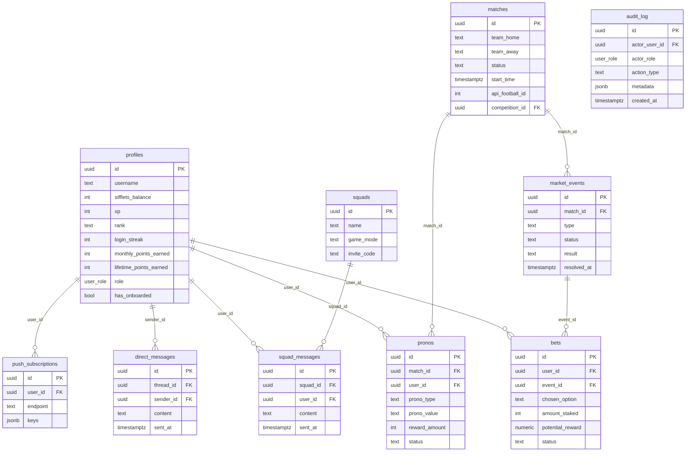

# 05 — Audit Données, Modèles & RGPD

> Branche : `stage` — 2026-05-11

---

## 5.1 Modèle de données

### Vue d'ensemble — 50+ tables, 114 migrations

### Conventions de nommage

✅ **Observé** : snake*case cohérent pour tables et colonnes. Timestamps en `timestamptz` (avec fuseau). UUIDs `gen_random_uuid()` par défaut. Préfixes cohérents (`notif*\_`, `is\_\_`, `has\_\*`).

**Anomalie** : `profiles.profiles_username_lower_key` créé sur `lower(username)` — convention lowercase correcte mais la contrainte UNIQUE est sur l'index et non sur une contrainte de table, ce qui peut surprendre.

---

## 5.2 Migrations

### Outil et état

✅ **Observé** : 114 fichiers de migration séquentiels dans `supabase/migrations/` (0001→0114). Versionnage manuel avec numéro de séquence, non géré par CLI Supabase (les fichiers sont appliqués manuellement via SQL Editor selon `CLAUDE.md`).

⚠️ **Absence de migration runner automatique** : Pas de `supabase db push` en CI/CD. Les migrations doivent être appliquées manuellement sur Supabase → risque de désynchronisation entre code et DB.

### Réversibilité

❌ **Observé** : Aucun fichier de rollback (DOWN migration). Toutes les migrations sont irréversibles — en cas d'erreur, il faut écrire une migration corrective.

### Migrations risquées détectées

| Migration                             | Risque                                                   | Notes                                                |
| ------------------------------------- | -------------------------------------------------------- | ---------------------------------------------------- |
| `0007_new_alert_types.sql`            | `DELETE FROM market_events`, `DELETE FROM alert_signals` | Suppression de données en migration — risque en prod |
| `0025_fix_matches_varchar.sql`        | Changement de type de colonne (varchar)                  | Potentiellement bloquant selon le contenu            |
| `0105_drop_polymarket_and_legacy.sql` | `DROP TABLE` tables legacy                               | Irréversible                                         |

---

## 5.3 Qualité des données

### Contraintes présentes

✅ **Observé** : Bon usage des contraintes :

- `CHECK (sifflets_balance >= 0)` — solde ne peut pas être négatif
- `UNIQUE (user_id, event_id)` sur `bets` — 1 pari par user par événement
- `CHECK (status IN (...))` sur la plupart des colonnes d'état
- `NOT NULL` largement utilisé sur les colonnes critiques
- FK avec `ON DELETE CASCADE` dominant (67 occurrences)

### Index

✅ **Observé** : Migration dédiée `0066_perf_indexes.sql` + `0102_add_missing_indexes.sql` pour les index manquants. Indexes composites sur les patterns les plus courants (ex. `(user_id, placed_at DESC)` sur `bets`).

**Gap potentiel** : `rate_limit_log` grossit sans TTL — sans purge, la table devient un problème de performance. Voir §5.6.

### Données dénormalisées

🟡 **Observé** : `profiles.winrate` est une valeur calculée maintenue manuellement — risque de désynchronisation si la RPC de mise à jour échoue. Idem pour `profiles.monthly_points_earned` / `lifetime_points_earned` / `season_points`.

### Soft delete

❌ **Observé** : Aucun soft delete — toutes les suppressions sont physiques. Les FK `ON DELETE CASCADE` propagent les suppressions. Ex : supprimer un utilisateur supprime ses bets, pronos, messages, etc. Cohérent mais irréversible.

---

## 5.4 Données personnelles & RGPD

### PII stockées

| Donnée          | Table                         | Chiffrement au repos | Chiffrement transit | Notes                             |
| --------------- | ----------------------------- | -------------------- | ------------------- | --------------------------------- |
| Email           | `auth.users` (Supabase Auth)  | ✅ Supabase gère     | ✅ HTTPS            | Non stocké dans `public.profiles` |
| Nom/pseudo      | `profiles.username`           | ✅ Supabase infra    | ✅                  | Choisi par l'user                 |
| Avatar Google   | `profiles.avatar_url`         | ✅                   | ✅                  | URL lh3.googleusercontent.com     |
| Push endpoint   | `push_subscriptions.endpoint` | ✅                   | ✅                  | VAPID — identifiant navigateur    |
| Messages privés | `direct_messages.content`     | ✅                   | ✅                  | Texte libre                       |
| Chat squad      | `squad_messages.content`      | ✅                   | ✅                  | Texte libre                       |
| IP address      | `audit_log.ip_address`        | ✅                   | ✅                  | Logs admin uniquement             |
| User agent      | `audit_log.user_agent`        | ✅                   | ✅                  | Logs admin uniquement             |
| Comportement    | PostHog (Cloud EU)            | ✅                   | ✅                  | Opt-in explicite                  |

### Chiffrement

✅ **Observé** : Chiffrement au repos et en transit géré par Supabase (PostgreSQL + TLS). Pas de chiffrement applicatif au niveau des champs — acceptable pour ce type de données (non-bancaires, non-médicales).

### Consentement analytics

✅ **Observé** : `ConsentBanner` avec opt-in explicite, `opt_out_capturing_by_default: true` dans PostHog, `localStorage["vartime_analytics_consent"]`.

### Durées de rétention

❌ **Non codées** : Aucune durée de rétention codée pour les données personnelles. Pas de mécanisme d'expiration automatique sur `direct_messages`, `squad_messages`, `bets`, `pronos`, `alert_signals`, `rate_limit_log`, `push_logs`.

### Droit à l'effacement / export RGPD

❌ **Absent dans le code** : Aucun endpoint `DELETE /api/profile` ou `GET /api/profile/export` détecté. La politique de confidentialité (`/privacy`) existe mais l'implémentation technique du droit à l'oubli n'est pas visible. La suppression d'un compte dans Supabase Auth déclencherait les CASCADE mais n'est pas exposée à l'utilisateur.

### Logs contenant des PII

🟡 **Observé** : Les crons (solo-activation, daily-digest, weekly-recap) récupèrent les emails via `supabase.auth.admin.getUserById()` pour envoyer des emails. Les emails sont passés via `emailMap` en mémoire et ne sont pas persistés dans la DB applicative — correct. Mais ils transitent dans les logs console si `log.info` les inclut.

---

## 5.5 Backups & Disaster Recovery

❓ **Non vérifiable** : Supabase gère les backups automatiquement (quotidien sur plan Pro). Aucune configuration de backup dans le code. Aucune documentation de procédure de restauration dans le repo.

---

## 5.6 Volume et croissance

### Tables à croissance non bornée (sans TTL/archivage)

| Table                   | Croissance                       | Risque                                                                                  |
| ----------------------- | -------------------------------- | --------------------------------------------------------------------------------------- |
| `rate_limit_log`        | +1 ligne par action rate-limitée | **P1** — pas de purge, index composite suffit jusqu'à ~10M rows mais doit être monitoré |
| `push_logs`             | +1 ligne par push envoyé         | **P1** — budget 3/jour/user × N users, accumule indéfiniment                            |
| `alert_signals`         | +1 par signal utilisateur        | **P2** — haute fréquence pendant matchs                                                 |
| `bets`                  | +1 par pari                      | **P2** — croissance linéaire, index ok                                                  |
| `audit_log`             | +1 par action admin              | **P3** — faible fréquence                                                               |
| `direct_messages`       | +1 par message                   | **P2** — dépend de l'adoption                                                           |
| `squad_messages`        | +1 par message                   | **P2** — idem                                                                           |
| `tweet_log`             | +1 par tweet auto                | **P3** — faible fréquence                                                               |
| `match_timeline_events` | +N par match                     | **P2** — purge possible après match `finished`                                          |

### Stratégie d'archivage

✅ **Partiel** : `season_archives` existe (migration `0081`) pour archiver les données de saison. `cleanup_match_presence()` (migration `0079`) nettoie la table de présence. `close_expired_market_events()` clôture les events expirés.

❌ **Absent** : Pas de purge sur `rate_limit_log`, `push_logs`, `alert_signals`, `direct_messages`, `squad_messages`.

---

## Ce que je n'ai pas pu auditer

- Taille réelle des tables en production
- Configuration des backups Supabase (Dashboard uniquement)
- Présence de RLS sur toutes les tables (seulement les migrations lues partiellement)
- Processus de restoration et temps estimé (RTO/RPO)

## Questions ouvertes pour le mainteneur

1. Les migrations sont-elles appliquées manuellement en production ? Y a-t-il un processus de validation avant application ?
2. Il n'y a pas d'endpoint de suppression de compte utilisateur — comment gérez-vous les demandes RGPD (droit à l'oubli) reçues par email ?
3. `rate_limit_log` et `push_logs` grandissent sans TTL — y a-t-il un cron de purge prévu, ou faut-il en créer un ?
4. Les messages privés (`direct_messages`) sont-ils soumis à une politique de rétention ? 6 mois ? Indéfini ?
5. Est-ce que Supabase Pro est activé pour bénéficier du backup journalier et de la réplication PITR ?
